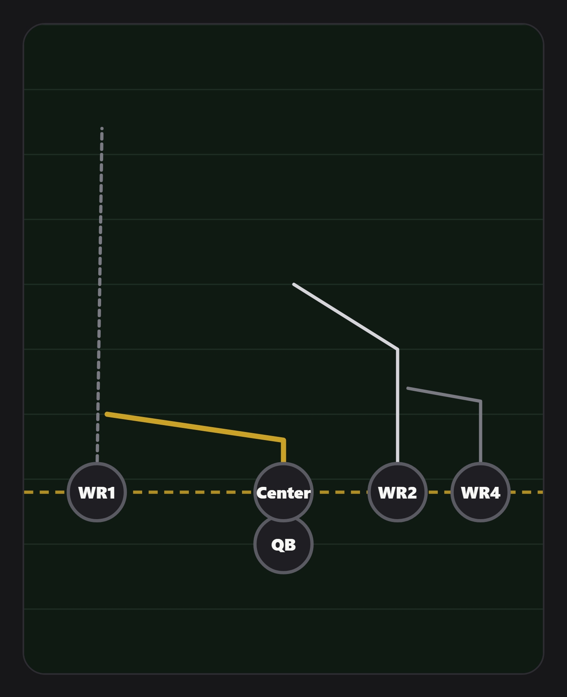

# SidelineX

**A mobile-first coaching command center for youth NFL FLAG football.** A coach
builds a playbook, plans games and practices, logs live snaps on the sideline,
gets deterministic AI-assisted play-calling help, scouts opponents, and reviews
postgame analytics — all recomputed from the real snap log, never separately
stored. Players get a read-only view of their own assignments and prep.

Built as a lightweight cloud web app: **Firebase** (Auth + Firestore + Hosting),
**Netlify Functions** for the auth-critical and AI server logic, and a
**vanilla-JS ES-module client with no build step**. ~330 automated tests.

> **Status: 10 milestones shipped, deployed, and running.**
> Live beta: `https://sidelinex-beta.web.app` &nbsp;·&nbsp;
> Full current state, architecture, security model, and roadmap:
> [`docs/PROJECT-STATUS.md`](docs/PROJECT-STATUS.md).



---

## What it does

| Area | What's built |
|---|---|
| **Playbook & Play Designer** | Guided step-by-step play builder (no gesture ambiguity): place players from a formation or one at a time, pick routes and preview them, set exact depth/break, assign each player a job. One structured `Play` entity powers every feature — never copied. |
| **Route animation** | "Watch Play" runs every route together on a timing schedule; a distance-based model and a real reaction-lag offset so a defender is shown running *alongside* a receiver, not on top of them — a teaching tool, explicitly not a simulation. |
| **Defensive intelligence** | Man / Zone / Pressure / Custom looks built into the same play; Man **and** Zone can both be authored for one play and switched non-destructively. |
| **Game Day + Live Stats** | 2–3-tap snap logging; one pure `applyResult(state, result, ruleConfig)` state engine everything builds on; live-derived stats (never stored); persistent Undo; local-first offline queue with idempotent client-generated snap IDs so a retried sync can't duplicate a snap. |
| **Sideline Advisor** | Deterministic filter → transparent ranking → real stats/context → *optional* AI explanation. The AI layer only paraphrases already-ranked reasons — it can't choose or score plays, and every number it emits is checked against the real input data (an invented number rejects the whole response and the deterministic reasons stay on screen). Every recommendation is logged against what the coach actually called, for self-scouting. |
| **Opponent Scouting** | Chip/dropdown-only scout profiles + a visual defensive-alignment editor reusing the Play Designer's exact data shape. Game Day blends scouting in — but **real current-game evidence outranks stale pregame scouting** once enough live snaps exist, and states the conflict explicitly when it happens. |
| **Postgame Analytics + Self-Scout** | A fully computed, never-stored postgame report (summary → players → plays → defense → self-scout → practice ideas). Opportunity-vs-production framing with real target-share math. Season Self-Scout rolls up every ended game through the *same* functions a single report uses — no parallel aggregation logic to drift. |
| **Practice Planner + Player Development** | Practice ideas flow from Postgame into real agenda blocks; existing plays attach by reference; assignments resolve to real players via Weekly Roles with zero retyping; one-tap attendance; neutral-vocabulary coach evaluations kept strictly separate from measured game stats. |

Full milestone-by-milestone detail: [`docs/PROJECT-STATUS.md`](docs/PROJECT-STATUS.md) §6.

## Design principles it's built against

- **Glanceable first, detailed second.**
- **If SidelineX already knows it, don't ask the coach to type it again.**
- **AI advises, coach decides** — no feature anywhere auto-calls a play,
  auto-schedules a practice item, or auto-completes a checklist item it can't
  actually verify.
- **Real current-game evidence outranks stale assumptions.**
- **No fake certainty — always respect sample size.** Every rate/average is shown
  with its real denominator; "LIMITED SAMPLE" language rather than false
  confidence; no screen states a fabricated percentage the data doesn't support.
- **Measured data and subjective observations are always structurally and
  visually separate** — never blended into one score.
- **Defense gets equal architectural treatment to offense.**
- **Every AI call is server-side only, coach-only, and has its numeric output
  validated against the real input before the client sees it.** If it fails or is
  rejected, the deterministic feature keeps working entirely on its own.

Longer form: [`docs/DESIGN-PRINCIPLES.md`](docs/DESIGN-PRINCIPLES.md).

## Architecture

```
sidelinex/
├── public/                    Firebase Hosting root — the entire client app, no build step
│   └── js/
│       ├── data.js            the ONE place real-vs-mock data is chosen (?dev=1)
│       ├── models/            thin Firestore accessors, one file per collection family
│       ├── dev/mock/          in-memory mock layer for the ?dev=1 offline preview
│       ├── gameday/           Game Day + Sideline Advisor pure engines
│       ├── postgame/          Postgame Analytics + Season Self-Scout pure engines
│       ├── scouting/          Opponent Scouting taxonomy + pure engine
│       ├── practice/          Practice Planner pure logic
│       ├── playbook/          Play Designer, route/defense animation, viewers, static SVG
│       └── views/{dashboard,playbook,games,scouting,practice,setup,login}/
├── netlify-functions/         7 Netlify Functions (see below) — separate Netlify site
├── functions/                 legacy Firebase Cloud Functions (kept, currently unused — see below)
├── firestore.rules            the entire authorization model
└── docs/                      PROJECT-STATUS, DESIGN-PRINCIPLES, FIREBASE-SETUP
```

**Why Netlify Functions exist:** the Firebase project's Blaze (pay-as-you-go)
billing plan is blocked by an external account issue, which blocks Firebase Cloud
Functions. The 4 auth-critical functions (`createTeam`, `login`, `addPlayer`,
`getRosterPicker`) were ported to Netlify Functions — a separate site, deployed
independently. Firestore, Firebase Auth (custom-token sign-in), and Hosting are
unaffected. 3 more Netlify Functions handle the AI features (`analyzePlay`,
`sidelineAdvisorExplain`, `postgameSummary`) — all coach-only, server-side, and
the Anthropic API key never touches the browser. The `functions/` directory keeps
the equivalent Cloud Functions source; if Blaze is ever unblocked, only one base
URL and two fetch helpers change back — every function's business logic and
security checks are already identical between the two.

## Security model

Enforced entirely in `firestore.rules`, keyed off `request.auth.token`
(`teamId`, `role`, `playerId?`) — minted server-side by the `login` function,
**never** trusted from client-sent document fields.

- `isTeamMember` (coach or player, same team) — read access to shared
  football-planning data (plays, games, weekly roles, game plan, snaps,
  recommendations, practices).
- `isCoach` — write on all of the above, plus **both read and write** on anything
  private: `scouts`, `practiceIdeas`, `players/{id}/evaluations`.
- `isSelf` — a player may read/write only their own `profile/self` and
  `checklist/current`.
- Credential hashes (`coachCredentials`, `playerCredentials`) have **no client
  read path at all** — only the Netlify Functions' Admin SDK touches them.
- Scouting reports and development observations are **coach-only for read too**,
  not just write — a conscious product decision, re-validated live at every
  milestone.
- **Validation method used at every milestone (not just unit tests):** mint real
  coach + player Firebase ID tokens via the live functions + Identity Toolkit
  REST API, then hit the Firestore REST API directly to prove read/write
  behaviour server-side against a throwaway team that is then deleted and
  confirmed 404.

No server credentials are in this repository. The Firebase Admin service account
and the Anthropic API key are read from environment variables only. The committed
Firebase **client** config (`public/js/firebase-config.js`) is a placeholder —
the values there are public-safe by design (they identify the project, they grant
nothing), and the live beta is deployed with its own real config that is not
committed. See [`SECURITY.md`](SECURITY.md).

## Run the offline preview

No Firebase project, no API keys, no build step.

```bash
git clone <this repo>
cd sidelinex/public
python -m http.server 8080      # or any static server
#   open http://localhost:8080/?dev=1
```

`?dev=1` swaps in an in-memory mock data layer (`public/js/dev/mock/`) — it never
touches Firebase, Auth, or any real project data, and it resets on reload. It
ships sample content for the Playbook (with the Play Designer and route
animation), Roster, and Play Analyzer; the Game Day / Advisor / Postgame /
Scouting views render their shells but need real game data to be exercised
(covered by the automated suites and the live server-side acceptance tests
described above).

## Tests

```bash
npm test                       # ~309 client pure-logic + auth call-logic tests, zero deps (Node 22+)
npm run test:netlify           # Netlify Functions (installs bcryptjs + firebase-admin)
npm run test:functions         # legacy Cloud Functions helpers
```

| Suite | Count |
|---|---:|
| Client pure-logic (scouting, gameday, playbook, postgame, practice, constants) + auth call-logic | ~309 |
| Netlify Functions | 68 |
| Legacy Cloud Functions helpers | 12 |

CI (`.github/workflows/ci.yml`) runs the client suite on Node 20 and 22, the
function suites, and a secret scan, on every push.

Plus, at every milestone since Sideline Advisor V1, a live production security +
functional acceptance test was run against real Firestore with real minted tokens
(most recent: Postgame 28/28, Practice Planner 27/27) — see
[`docs/PROJECT-STATUS.md`](docs/PROJECT-STATUS.md) §5, §8.

## How this was built

**Rudolph Miller owns the product.** The problem framing, the product direction
and scope of every milestone, the architecture and security decisions (the
LLM-advises / deterministic-code-decides split; the "recompute from snaps, never
store derived data" rule; the server-side AI-number-validation guard; the
coach-only vs team-readable data separation; the "no fake certainty" standard),
the testing expectations (unit tests **plus** a live server-side security
acceptance test at every milestone), and the acceptance of each milestone against
those criteria — all mine.

Implementation was **AI-assisted**: **Claude Code** wrote most of the source under
that direction, milestone by milestone; **ChatGPT** acted as an architecture and
adversarial reviewer. The commit history reflects this. It does not claim I
hand-typed every line.

## Known limitations (honest, current)

- **No cross-device / multi-coach concurrent editing.** Game Day's local-first
  queue only knows about writes made on the device that made them.
- **Practice role resolution is a documented interpretation, not a perfect
  model** — a practice isn't tied to one game, so role assignments resolve using
  the most recent game's Weekly Roles as context.
- **`?dev=1` preview mode is gated only by a URL parameter** and must be removed
  or build-flag-gated before any real public beta.
- **The optional AI layers can and do return null** (anti-fabrication rejection
  or a transient API failure) by design — a coach may occasionally see fewer AI
  sentences than expected; the deterministic features never depend on these.
- **Mobile-first by design** — there is no desktop-optimised layout; on a laptop
  it renders as a phone-width column.

Full list: [`docs/PROJECT-STATUS.md`](docs/PROJECT-STATUS.md) §10.

## License

Proprietary — see [`LICENSE`](LICENSE). Published for portfolio review; not
open source. SidelineX may become a commercial product.
